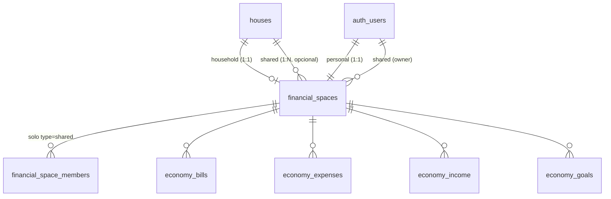

# 🗂️ Financial Spaces — arquitectura de Economía

Rediseño del módulo Economía alrededor de un único concepto: el **Financial
Space**. No hay tres sistemas (Personal / Shared / Household) sino un único
esquema con una regla de permisos que varía por tipo. Este documento describe
la arquitectura; **no incluye pantallas** — eso es trabajo de una fase
posterior.

Implementado en [`supabase/migrations/20260803_022_financial_spaces.sql`](../supabase/migrations/20260803_022_financial_spaces.sql)
y expuesto en JS por [`src/modules/economy/services/financialSpacesService.js`](../src/modules/economy/services/financialSpacesService.js).

## El modelo



| type | visibility | quién accede | house_id |
|---|---|---|---|
| `personal` | `private` | solo `owner_id` (ni el Owner de la casa) | siempre `null` |
| `shared` | `invite_only` | miembros en `financial_space_members` | opcional (hoy siempre presente, ver más abajo) |
| `household` | `house` | `can_manage_economy(house_id)` — el rol/override de siempre | obligatorio |

`type` y `visibility` son columnas separadas (a petición de diseño, para que
RLS y lecturas futuras no necesiten un `CASE`), pero un `check` constraint
(`financial_spaces_type_visibility_match`) impide que diverjan.

Cada tabla de movimientos (`economy_bills`, `economy_expenses`,
`economy_income`, `economy_goals`) tiene ahora una columna
**`financial_space_id` (obligatoria)** — los movimientos apuntan siempre al
espacio, nunca directamente a un usuario ni a una casa.

## Por qué no una membership table única para los tres tipos

El encargo pide "un único sistema, no tres". Eso se cumple a nivel de **datos
y API** (una tabla de spaces, una de movimientos, una función de permisos),
pero la resolución de permisos en sí varía por tipo porque el propio encargo
lo exige (Personal = solo el dueño; Household = rol de la casa). Forzar una
`financial_space_members` también para `household` obligaría a mantenerla
sincronizada con `home_members` (altas, bajas, cambios de rol, el override
por miembro) — un segundo sistema duplicando al primero, con más superficie
de bugs, no menos. En su lugar, `can_access_financial_space(space_id)` es la
única función que un movimiento necesita consultar; internamente reutiliza
`can_manage_economy(house_id)` para `household` (la misma función auditada
que ya usan `economy_bills/expenses/income/goals` hoy) y consulta
`financial_space_members` solo para `shared`.

## Permisos

```
can_access_financial_space(space_id)      -- ¿puede leer/escribir movimientos?
  personal  → owner_id = auth.uid()
  shared    → fila en financial_space_members
  household → can_manage_economy(house_id)   [rol admin/adult + economy_override, sin cambios]

can_manage_financial_space(space_id)      -- ¿puede administrar el espacio (renombrar/invitar/archivar)?
  household → is_house_admin(house_id)
  personal / shared → owner_id = auth.uid()
```

`child` nunca accede a `household` (como hoy) y tampoco puede ser invitado a
un `shared` space atado a una casa: `add_financial_space_member` exige
`user_can_manage_economy(house_id, target_user)` sobre el invitado, así que
un `child` sin `economy_override` queda fuera también de los espacios
compartidos de esa casa — la regla de "Child: nunca accede" es una sola regla
reutilizada, no una nueva.

## Auto-provisioning

- **Personal**: se crea en `handle_new_user()` (trigger de `auth.users`), un
  espacio por usuario para siempre, independiente de a qué casa pertenezca o
  deje de pertenecer.
- **Household**: se crea en `create_house()`, un espacio por casa.
- Backfill incluido en el mismo migration para usuarios/casas ya existentes.
- **Shared**: no se auto-crea — `create_shared_financial_space(name, house_id, icon)`
  a demanda; el creador queda como `owner_id` y primer miembro.

## Migración de los datos existentes (no rompe pantallas actuales)

Antes de este migration, todo movimiento pertenecía implícitamente a un
`household` (única variante que existía). El migration:

1. Crea un espacio `household` para cada casa existente.
2. Añade `financial_space_id` a las 4 tablas y lo rellena con el espacio
   `household` correspondiente a su `house_id` actual.
3. Convierte `house_id` en una **columna derivada**: un trigger
   (`economy_sync_house_id`) la sincroniza siempre desde
   `financial_spaces.house_id` antes de cada insert/update de
   `financial_space_id`. Deja de ser la fuente de verdad de permisos, pero
   sigue estando poblada y correcta.
4. Cambia RLS de las 4 tablas de `can_manage_economy(house_id)` a
   `can_access_financial_space(financial_space_id)`.

Efecto práctico: `economyService.js` y toda la UI actual siguen funcionando
sin tocar una línea — siguen filtrando por `house_id` y ese valor sigue
siendo correcto — porque hoy el 100% de los datos son `household`. El cambio
de arquitectura vive en la base de datos; el corte de la UI hacia "elegir un
espacio" es trabajo de una fase posterior, deliberadamente fuera de este
encargo.

## Por qué no se fusionaron bills/expenses/income en una tabla polimórfica

Se consideró y se descartó para este cambio: `economy_bills` tiene
`due_date/status/frequency/reminder_*` que no aplican a un ingreso, y
fusionar las tres tablas es una refactorización mucho más arriesgada que no
pidió el encargo ("los movimientos apuntan al space", no "hay una tabla de
movimientos"). Las 4 tablas ya comparten el mismo contenedor (`financial_space_id`)
y la misma regla de permisos — eso es suficiente para que se comporten como
"un único sistema" de cara al resto de la arquitectura.

## Escalabilidad futura (sin tocar esta estructura)

Todo lo siguiente puede añadirse como una tabla nueva con su propio
`financial_space_id`, reutilizando `can_access_financial_space` sin más
cambios de permisos:

- **Presupuestos** por categoría y periodo (hoy `economy_goals.type =
  'spending_limit'` es un límite simple sin periodo; un futuro `budgets`
  con mes/año explícito conviviría igual).
- **Objetivos de ahorro compartidos** entre varios `shared` spaces — ya
  soportado hoy por `economy_goals` en cualquier space.
- **Fondos comunes** (household): una tabla `financial_space_balances` o
  similar, con `financial_space_id` y sin necesidad de nuevas reglas de RLS.
- Un futuro **Shared space sin casa** (p. ej. "Viaje Japón 2027" entre
  personas de casas distintas) ya cabe en el esquema: `house_id` es
  `nullable` en `shared`; solo haría falta relajar la validación actual de
  `create_shared_financial_space`/`add_financial_space_member` (hoy exige
  que invitador e invitado compartan casa) el día que se quiera ese caso.

## API expuesta (`financialSpacesService.js`)

| Función | RPC / tabla | Notas |
|---|---|---|
| `listMySpaces()` | `my_financial_spaces` | los 3 tipos, filtrados por acceso |
| `getPersonalSpace()` | `my_financial_spaces` | siempre existe |
| `getHouseholdSpace(houseId)` | `my_financial_spaces` | siempre existe |
| `listSharedSpaces(houseId?)` | `my_financial_spaces` | |
| `createSharedSpace(name, houseId, icon?)` | `create_shared_financial_space` | crea + añade al creador |
| `renameSpace(spaceId, name)` | `rename_financial_space` | owner/admin |
| `archiveSpace(spaceId)` | `archive_financial_space` | solo `shared` |
| `listSpaceMembers(spaceId)` | `financial_space_members` join `profiles` | |
| `addMember(spaceId, userId)` | `add_financial_space_member` | valida misma casa + acceso a Economía |
| `removeMember(spaceId, userId)` | `remove_financial_space_member` | no permite quitar al owner |
| `leaveSpace(spaceId)` | `leave_financial_space` | el owner no puede salir, debe archivar |

Sigue el contrato `throw` en error (como `taskService`/`economyGoalsService`),
no el de `economyService.js`, cuyo silenciado de errores ya está señalado
como bug en `AUDITORIA_HAVEN_1.0.md`.
